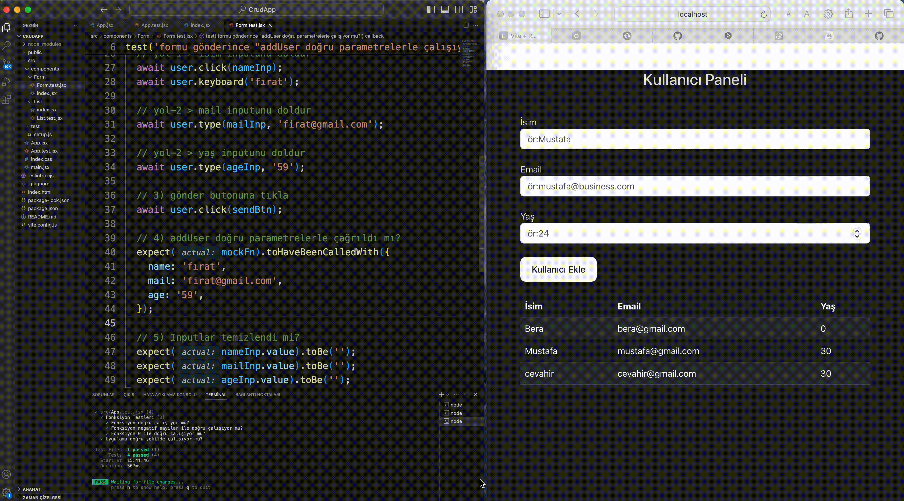

# About Project 

- A simple crud project was developed using the Vite project and tested with unitTest. 

- Vite projesi kullanarak basit bir crud projesi geliştirildi ve unitTest ile test edildi. 

# Test Library
npm i
- @testing-library/jest-dom
- @testing-library/react
- @testing-library/user-event
- jsdom
- vitest

--save-dev (enter)

# DevDependecy

- proje yayınlandığında projenin çalışması için gerekli olmayan ama proje geliştirilirken geliştirici yararına olan kütüphaneler bu bölüme indirilir.

- DevDependecy silinmesi projenin çalışmasını etkilemez.

- Test kütüphaneler koddaki hatayı tespit eden, kodu düzenleyen kütüphaneler olarak indirilir. React projelerinde bu kütüphanler kurulu olarak gelirken vite projelerinde bizim eklememiz gerekmektedir. 

# Project Gif:
